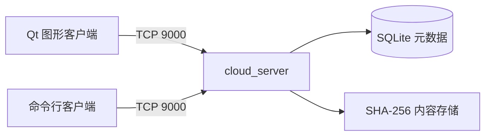

<!-- 负责人：成员4：客户端界面 -->
# LanCloudDrive

LanCloudDrive 是一个使用 C++20、Qt 6、TCP 和 SQLite 实现的局域网网盘。项目采用客户端/服务端架构：一台 Windows 电脑运行服务端，同一局域网内的多台电脑可以通过 Qt 图形客户端或命令行客户端注册、登录并管理各自的文件。

当前项目同时保留两种客户端：

- `client_qt_example`：主要使用入口，提供独立登录页、文件管理界面和传输进度；
- `cloud_client`：命令行客户端，适合协议调试、自动化验证和低依赖演示。

> 安全说明：当前协议没有 TLS，口令通过 TCP 明文传输，数据库中的口令摘要也只适合课程演示。请仅在可信局域网中使用，不要直接暴露到公网，也不要存放真实敏感文件。

## 快速启动（Qt 图形客户端）

已安装 Visual Studio 2022、CMake、vcpkg 和 Qt 6 MSVC x64 后，在仓库根目录执行：

```powershell
$env:QT_ROOT = "C:\Qt\6.8.3\msvc2022_64"   # 改为自己的 Qt 安装目录
cmake --preset windows-debug-qt -DCMAKE_PREFIX_PATH="$env:QT_ROOT"
cmake --build --preset windows-debug-qt
```

在第一个终端启动服务端：

```powershell
.\out\build\windows-debug-qt\server\Debug\cloud_server.exe 9000 .\runtime
```

在第二个终端启动 Qt 客户端：

```powershell
.\out\build\windows-debug-qt\client_qt\Debug\client_qt_example.exe
```

本机连接填写 `127.0.0.1:9000`；其他同一局域网设备填写服务端电脑的 IPv4 地址和端口 `9000`。首次使用先在登录页选择 `Create account` 注册，再选择 `Sign in` 登录。

## 当前功能

### Qt 图形客户端

- 登录页与网盘工作区分离；
- 注册、登录、注销及切换账号后主动刷新；
- 浏览根目录和多级子目录；
- 新建目录、重命名和递归删除；
- 上传单个文件；
- 递归上传完整文件夹，包括嵌套目录、空目录和中文路径；
- 下载单个文件；
- 上传、下载支持断点续传：中断后可重连从已传输位置继续，不重复已完成的字节；
- 右键递归下载完整文件夹并还原目录结构；
- 上传、下载整体进度条和活动记录；
- 文件大小、修改时间、目录图标和路径导航；
- 记住上一次使用的服务端地址和端口；
- 网络与文件操作放在独立 Qt 工作线程中，避免阻塞界面。
- 右键单个文件生成 8 位提取码，并在另一台客户端领取文件。
- 单击文件可直接预览文本、Markdown 和常见代码文件；DOCX、文字型 PDF 会在服务端临时转换后展示，不会产生额外文件。
- 需要保留转换结果时，可右键 DOCX/PDF 选择 `Save as Markdown`，将 Markdown 文件写入原文件所在目录。

## 用提取码传递文件

1. 发送者登录后，右键一个文件并选择 `Create extraction code`；
2. 将弹出的 8 位提取码发送给接收者；
3. 接收者登录自己的账号，在工具栏点击 `Extract code` 并输入该码；
4. 文件会出现在接收者的 `My files` 根目录，双方均可各自下载。

提取码有效期为 24 小时，仅可由非发送者账号领取一次。领取复用服务器中的同一份 SHA-256 内容实体，不会额外复制文件；发送者原文件仍保留。当前版本仅支持单文件提取码，文件夹可先下载后再上传。

### 服务端与公共协议

- 服务端监听 `0.0.0.0:9000`，允许同一局域网中的多个客户端连接；
- 服务端采用“每连接一线程”的处理方式；
- 固定 24 字节网络序报文头，处理 TCP 分包和粘包；
- 用户注册、登录、注销和随机会话令牌；
- SQLite 持久化及用户数据隔离；
- 文件按 256 KiB 分块上传和下载；
- 上传先写入 `.part`，完成后重新计算 SHA-256 再提交节点；
- 上传会话进度持久化到数据库，中断后可断点续传（`beginUpload` 复用同一 `transferId`，客户端从服务端已收偏移继续）；
- 下载写入 `.download`，断点续传复用已有临时文件，只拉取剩余字节；
- 按 `SHA-256 + size` 去重，相同内容可以秒传；
- 每个用户磁盘配额（默认 10 GB）：上传、秒传、删除时校验并原子维护已用空间，超限返回 `QUOTA_EXCEEDED`；
- 上传会话过期自动清理：后台线程周期回收过期的会话及其临时 `.part` 文件，活跃会话不受影响；
- 拒绝路径穿越名称，服务端真实存储路径不直接使用用户文件名。
- 支持服务端临时预览 `.docx` 和文字型 `.pdf`，以及按需将其转换为同目录 Markdown 文件。

## 系统结构



`cloud_common` 是协议、JSON、SHA-256 和 socket 封装的唯一公共实现。Qt 界面通过 `QtClient` 调用 `ClientCore`，不会直接操作裸 socket。

## Windows 开发环境

需要安装：

1. Visual Studio 2022，并勾选“使用 C++ 的桌面开发”；
2. CMake 3.24 或更高版本；
3. Git for Windows；
4. vcpkg；
5. Qt 6 的 MSVC 2022 64 位组件，例如 `msvc2022_64`；
6. VS Code（可选，适合日常开发）。

Qt 客户端使用 CMake，不要求单独调用 `qmake`。

### VS Code 推荐扩展

- C/C++；
- CMake Tools；
- GitHub Copilot（可选）；
- GitHub Pull Requests（可选，用于查看 Issue、提交和审查 PR）。

## 准备 vcpkg 和 Qt

首次准备 vcpkg：

```powershell
git clone https://github.com/microsoft/vcpkg C:\dev\vcpkg
C:\dev\vcpkg\bootstrap-vcpkg.bat
$env:VCPKG_ROOT = "C:\dev\vcpkg"
```

设置 Qt 根目录。请把示例路径改成自己的实际安装位置：

```powershell
$env:QT_ROOT = "C:\Qt\6.8.3\msvc2022_64"
$env:Qt6_DIR = "$env:QT_ROOT\lib\cmake\Qt6"
```

如果希望以后打开终端时仍然可用，可以把 `VCPKG_ROOT` 和 `Qt6_DIR` 设置为用户环境变量。

## 构建 Qt 图形客户端

在仓库根目录运行：

```powershell
cmake --preset windows-debug-qt -DCMAKE_PREFIX_PATH="$env:QT_ROOT"
cmake --build --preset windows-debug-qt
```

Debug 版本的主要程序通常位于：

```text
out/build/windows-debug-qt/server/Debug/cloud_server.exe
out/build/windows-debug-qt/client_cli/Debug/cloud_client.exe
out/build/windows-debug-qt/client_qt/Debug/client_qt_example.exe
```

Release 构建：

```powershell
cmake --preset windows-release-qt -DCMAKE_PREFIX_PATH="$env:QT_ROOT"
cmake --build --preset windows-release-qt
```

对应 Qt 客户端通常位于：

```text
out/build/windows-release-qt/client_qt/Release/client_qt_example.exe
```

如果 `cmake` 没有加入 `PATH`，可以在 VS Code 的 CMake Tools 中选择 Visual Studio 2022 Kit，或者使用 CMake 安装目录中的完整可执行路径。

## 在 VS Code 中构建

1. 使用 VS Code 打开仓库根目录；
2. 在状态栏或命令面板中执行 `CMake: Select Configure Preset`；
3. 选择 `windows-debug-qt`；
4. 确认当前 Kit 为 Visual Studio 2022 x64；
5. 执行 `CMake: Configure`；
6. 将构建目标切换为 `client_qt_example`；
7. 执行 `CMake: Build`。

如果配置阶段提示找不到 Qt 6，请确认 `Qt6_DIR` 或 `CMAKE_PREFIX_PATH` 指向 `msvc2022_64`，而不是 MinGW 版本。

## 启动服务端

在作为服务端的电脑上运行：

```powershell
.\out\build\windows-debug-qt\server\Debug\cloud_server.exe 9000 .\runtime
```

参数说明：

```text
cloud_server.exe [端口] [运行时数据目录]
```

省略参数时，端口默认为 `9000`，运行时数据目录默认为服务端可执行文件旁边的 `runtime`。

服务端窗口需要持续运行。所有账号、目录元数据和文件实体都保存在运行时数据目录中。

## 同一局域网多客户端

### 1. 查询服务端 IP

在服务端电脑运行：

```powershell
ipconfig
```

找到当前无线网卡或以太网网卡的 IPv4 地址，例如 `192.168.1.10`。

### 2. 放行 TCP 9000

可以在 Windows Defender 防火墙中允许 `cloud_server.exe` 通过专用网络。也可以在管理员 PowerShell 中添加仅限本地子网的规则：

```powershell
New-NetFirewallRule `
  -DisplayName "LanCloudDrive Server (TCP 9000)" `
  -Direction Inbound `
  -Action Allow `
  -Protocol TCP `
  -LocalPort 9000 `
  -RemoteAddress LocalSubnet `
  -Profile Private,Public
```

不再使用时可以删除这条规则：

```powershell
Remove-NetFirewallRule -DisplayName "LanCloudDrive Server (TCP 9000)"
```

### 3. 启动客户端

服务端电脑本机可以填写：

```text
127.0.0.1:9000
```

其他局域网设备应填写服务端的 IPv4 地址：

```text
192.168.1.10:9000
```

每台客户端电脑都运行自己的 Qt 客户端。首次使用先创建账号，再使用相同账号登录。不同账号的根目录互相隔离。

客户端不需要复制 `runtime`、数据库或 `storage` 文件夹；这些仅保留在服务端电脑。多台客户端可以同时连接同一个 `IP:9000`，每个账号都有独立根目录，并可通过提取码把单个文件交给其他账号。

如果无法连接，请依次检查：

- 所有设备是否连接到同一路由器或热点；
- 服务端窗口是否仍在运行；
- 客户端填写的是否为服务端当前 IPv4 地址；
- TCP 9000 是否被防火墙拦截；
- Wi-Fi 是否启用了客户端隔离；
- 服务端 IP 是否因重新联网而变化。

## Qt 客户端操作

- 双击目录进入；
- 点击 `Up` 返回上一级；
- 点击 `New folder` 创建目录；
- 点击 `Upload file` 上传文件；
- 点击 `Upload folder` 递归上传整个文件夹；
- 右键文件或目录可以下载、重命名或删除；
- 下载目录时选择“保存到哪个父目录”，客户端会在其中创建同名文件夹；
- 已存在的下载目标不会被覆盖；
- 上传、下载完成后文件列表会主动刷新。

## 把 Qt 客户端部署到其他电脑

只复制 `client_qt_example.exe` 不够，目标电脑还需要 Qt 运行库。应先构建 Release，再使用 Qt 自带的 `windeployqt` 收集依赖：

```powershell
$source = ".\out\build\windows-release-qt\client_qt\Release\client_qt_example.exe"
$target = ".\dist\LanCloudDrive-client-win64"

New-Item -ItemType Directory -Force $target
Copy-Item $source "$target\LanCloudDrive.exe"
& "$env:QT_ROOT\bin\windeployqt.exe" `
  --release `
  --compiler-runtime `
  --dir $target `
  "$target\LanCloudDrive.exe"
```

将整个 `dist/LanCloudDrive-client-win64` 文件夹复制到其他 Windows x64 电脑，运行其中的 `LanCloudDrive.exe`，然后填写服务端局域网 IP。

## 命令行客户端

不需要 Qt GUI 时，可以使用原有命令行客户端：

```powershell
.\out\build\windows-debug\server\Debug\cloud_server.exe 9000 .\runtime
.\out\build\windows-debug\client_cli\Debug\cloud_client.exe 127.0.0.1 9000
```

常用命令：

| 命令 | 含义 |
|---|---|
| `register <用户名> <口令>` | 注册账号 |
| `login <用户名> <口令>` | 登录并保存本次进程内令牌 |
| `ls [父目录ID]` | 列出目录，不传参数时列根目录 |
| `mkdir <父目录ID> "名称"` | 新建目录 |
| `rename <节点ID> "新名称"` | 重命名文件或目录 |
| `rm <节点ID>` | 删除文件或递归删除目录 |
| `put "本地路径" <父目录ID> ["远端名称"]` | 上传单个文件 |
| `get <节点ID> "本地路径"` | 下载单个文件 |
| `convert <节点ID> ["输出名称.md"]` | 在服务端将 `.docx`/文字型 `.pdf` 转为 Markdown |
| `logout` | 注销当前令牌 |
| `help` / `quit` | 显示帮助 / 退出 |

根目录 ID 固定为 `0`。含空格的名称或路径需要放在双引号中。

## CLI 一键构建与免安装包

原有脚本仍用于构建和验证服务端及命令行客户端：

```text
build_release.bat
```

成功后生成：

```text
dist/LanCloudDrive_v0.1_windows_x64_portable.zip
out/build/windows-release/LanCloudDrive.sln
```

该脚本生成的现有免安装包只包含 `cloud_server.exe` 和命令行客户端。Qt 图形客户端需要按照上一节单独使用 `windeployqt` 部署。

完整的 Windows 构建说明见 [BUILD_WINDOWS.md](BUILD_WINDOWS.md)。

## 运行时数据

```text
runtime/
├─ cloud.db
└─ storage/
   ├─ blobs/ab/cd/<sha256>
   └─ temp/<transfer>.part
```

- `cloud.db` 保存账号、目录节点、文件节点和内容索引；
- `storage/blobs` 保存按 SHA-256 寻址的文件实体；
- `storage/temp` 保存未完成上传；
- 运行时数据库、blob、`.part` 和 `.download` 文件均不应提交到 Git。

备份服务端时，应同时备份完整的 `runtime` 目录。不要只复制数据库或只复制 `storage`。

## 当前限制

- 没有 TLS，不适合公网部署；
- 没有传输取消和自动重试；
- 单个 Qt 客户端内的网络任务按工作线程顺序执行；
- 文件夹传输复用现有的建目录、列目录和单文件传输协议；
- 文件夹传输中途失败时，已经成功创建或传输的部分不会自动回滚；
- 下载目录要求目标父目录下不存在同名文件夹；
- 当前 GUI 便携包尚未合并进 `build_release.bat`；
- 桌宠等装饰功能尚未实现。

## 工程结构

```text
LanCloudDrive/
├─ common/       公共协议、JSON、SHA-256、TCP 和可执行路径工具
├─ server/       服务端、会话、SQLite、目录和文件传输
├─ client_core/  同步客户端 API 与 Qt 工作线程适配层
├─ client_cli/   命令行客户端
├─ client_qt/    Qt 6 Widgets 图形客户端
├─ tests/        公共层测试
├─ docs/         协议、数据库、迭代和团队维护说明
├─ packaging/    服务端与 CLI 启动脚本
├─ tools/        vcpkg、打包和冒烟验证脚本
└─ runtime/      本地运行数据
```

更多设计资料：

- [协议说明](docs/protocol.md)
- [数据库说明](docs/database.md)
- [迭代计划](docs/iterations.md)
- [团队维护边界](docs/team-ownership.md)
- [Windows 构建说明](BUILD_WINDOWS.md)
